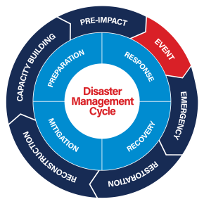

# PRISMA - Go-to-Market Strategy

**Nombre proyecto**: PRISMA (posible empresa futura: RESILIA)  
**Contacto**: Miguel Escribano  

- [PRISMA - Go-to-Market Strategy](#prisma---go-to-market-strategy)
  - [Resumen Ejecutivo](#resumen-ejecutivo)
    - [El problema que resolvemos](#el-problema-que-resolvemos)
    - [Nuestra solución](#nuestra-solución)
    - [Estado actual del proyecto](#estado-actual-del-proyecto)
    - [Mercado y oportunidad](#mercado-y-oportunidad)
    - [Credibilidad del fundador](#credibilidad-del-fundador)
    - [Plan de financiación y validación](#plan-de-financiación-y-validación)
    - [Arquitectura PRISMA - Programa de Desarrollo AIOps](#arquitectura-prisma---programa-de-desarrollo-aiops)
  - [1. DESCUBRIMIENTO, RECOPILACIÓN DE DATOS Y ANÁLISIS](#1-descubrimiento-recopilación-de-datos-y-análisis)
    - [A. Definición de producto](#a-definición-de-producto)
      - [1. Identificación del problema del mercado: ¿qué problemas se resuelven? (max 300 palabras)](#1-identificación-del-problema-del-mercado-qué-problemas-se-resuelven-max-300-palabras)
      - [2. Validación del problema del mercado: explique y valide cómo el conjunto de características del producto resuelve el problema o los problemas (max 300 palabras)](#2-validación-del-problema-del-mercado-explique-y-valide-cómo-el-conjunto-de-características-del-producto-resuelve-el-problema-o-los-problemas-max-300-palabras)
    - [B. Objetivos estratégicos](#b-objetivos-estratégicos)
      - [1. ¿Qué esperas conseguir en 6 meses? ¿En 1 año? ¿En 2 años? (max 500 palabras)](#1-qué-esperas-conseguir-en-6-meses-en-1-año-en-2-años-max-500-palabras)
    - [C. Identificación del Mercado y de tu cliente](#c-identificación-del-mercado-y-de-tu-cliente)
      - [1. Definición del mercado: ¿Quiénes son los mercados objetivo? ¿Cuál es el tamaño de los mercados objetivo (números, accesibilidad y poder adquisitivo)? (max 300 palabras)](#1-definición-del-mercado-quiénes-son-los-mercados-objetivo-cuál-es-el-tamaño-de-los-mercados-objetivo-números-accesibilidad-y-poder-adquisitivo-max-300-palabras)
      - [2. Segmentación de clientes: ¿qué clústeres o grupos similares con comportamientos similares existen dentro de los mercados objetivo? (max 300 palabras)](#2-segmentación-de-clientes-qué-clústeres-o-grupos-similares-con-comportamientos-similares-existen-dentro-de-los-mercados-objetivo-max-300-palabras)
      - [3. Información sobre los clientes/mercados: ¿Qué investigaciones de mercado respaldan los objetivos? (max 300 palabras)](#3-información-sobre-los-clientesmercados-qué-investigaciones-de-mercado-respaldan-los-objetivos-max-300-palabras)
    - [D. Inteligencia de Mercado e inteligencia competitiva](#d-inteligencia-de-mercado-e-inteligencia-competitiva)
      - [1. Identificación de tendencias del mercado: ¿Cómo afectarán las tendencias al lanzamiento y la viabilidad del producto? (max 150 palabras)](#1-identificación-de-tendencias-del-mercado-cómo-afectarán-las-tendencias-al-lanzamiento-y-la-viabilidad-del-producto-max-150-palabras)
      - [2. Competencia/Panorama competitivo: ¿Quiénes son los principales competidores y cómo reaccionarán ante la entrada en el mercado o lanzamiento de mi producto? (max 150 palabras)](#2-competenciapanorama-competitivo-quiénes-son-los-principales-competidores-y-cómo-reaccionarán-ante-la-entrada-en-el-mercado-o-lanzamiento-de-mi-producto-max-150-palabras)
    - [E. Opciones de distribución](#e-opciones-de-distribución)
      - [1. ¿Qué opciones de venta y distribución hay disponibles? (max 150 palabras)](#1-qué-opciones-de-venta-y-distribución-hay-disponibles-max-150-palabras)
    - [F. Prueba beta/Prueba de mercado](#f-prueba-betaprueba-de-mercado)
      - [1. ¿Cómo probarás el producto y recopilarás opiniones sobre este nuevo lanzamiento? (max 150 palabras)](#1-cómo-probarás-el-producto-y-recopilarás-opiniones-sobre-este-nuevo-lanzamiento-max-150-palabras)
  - [2. ESTRATEGIA GO-TO-MARKET](#2-estrategia-go-to-market)
    - [A. Business Case](#a-business-case)
      - [1. ¿Por qué estás haciendo esto y qué esperas obtener? (max 150 palabras)](#1-por-qué-estás-haciendo-esto-y-qué-esperas-obtener-max-150-palabras)
    - [B. Estrategia de mercado](#b-estrategia-de-mercado)
      - [1. Propuesta de valor: ¿qué valor tiene la oferta propuesta y por qué alguien me compraría a mi en lugar de a la competencia? (max 150 palabras)](#1-propuesta-de-valor-qué-valor-tiene-la-oferta-propuesta-y-por-qué-alguien-me-compraría-a-mi-en-lugar-de-a-la-competencia-max-150-palabras)
      - [2. Posicionamiento – ¿Cómo te gustaría que el mercado viera tu oferta entre otras opciones? (max 150 palabras)](#2-posicionamiento--cómo-te-gustaría-que-el-mercado-viera-tu-oferta-entre-otras-opciones-max-150-palabras)
      - [3. Mensaje: ¿cuáles son los tres principales problemas resueltos o beneficios obtenidos? (max 150 palabras)](#3-mensaje-cuáles-son-los-tres-principales-problemas-resueltos-o-beneficios-obtenidos-max-150-palabras)
      - [4. Modelo de ventas y asistencia técnica: ¿cómo venderé y prestaré asistencia técnica al producto? (max 150 palabras)](#4-modelo-de-ventas-y-asistencia-técnica-cómo-venderé-y-prestaré-asistencia-técnica-al-producto-max-150-palabras)
      - [5. Recorrido del comprador (etapas del proceso de decisión): ¿cuáles son los comportamientos que adopta un cliente antes y después de la compra? (max 150 palabras)](#5-recorrido-del-comprador-etapas-del-proceso-de-decisión-cuáles-son-los-comportamientos-que-adopta-un-cliente-antes-y-después-de-la-compra-max-150-palabras)
      - [6. Perfiles de compradores: ¿cuáles son las características y comportamientos de los usuarios del producto? (max 150 palabras)](#6-perfiles-de-compradores-cuáles-son-las-características-y-comportamientos-de-los-usuarios-del-producto-max-150-palabras)
      - [7. Casos de uso – ¿Cómo se utilizará el producto? (max 150 palabras)](#7-casos-de-uso--cómo-se-utilizará-el-producto-max-150-palabras)
    - [C. Pricing](#c-pricing)
      - [1. ¿Qué estrategia de precios debería de ser utilizada? ¿Descuentos de lanzamiento para fomentar las pruebas?](#1-qué-estrategia-de-precios-debería-de-ser-utilizada-descuentos-de-lanzamiento-para-fomentar-las-pruebas)
    - [D. Ventas y soporte de ventas](#d-ventas-y-soporte-de-ventas)
      - [1. Herramientas – ¿Qué tipo de material promocional, demos y presentaciones se necesitan?](#1-herramientas--qué-tipo-de-material-promocional-demos-y-presentaciones-se-necesitan)
      - [2. Adquisición de clientes y mix de canales: ¿cuál es el enfoque adecuado? ¿Ventas directas? ¿Distribuidores de valor añadido?](#2-adquisición-de-clientes-y-mix-de-canales-cuál-es-el-enfoque-adecuado-ventas-directas-distribuidores-de-valor-añadido)
      - [3. Apoyo a la formación: ¿cómo se formará y se prestará apoyo al canal de ventas?](#3-apoyo-a-la-formación-cómo-se-formará-y-se-prestará-apoyo-al-canal-de-ventas)
    - [E. Soporte técnico](#e-soporte-técnico)
      - [1. CRM – ¿Qué herramienta se utilizará para crear y gestionar las relaciones con los clientes?](#1-crm--qué-herramienta-se-utilizará-para-crear-y-gestionar-las-relaciones-con-los-clientes)
      - [2. Asistencia para la formación: ¿los clientes necesitarán formación?](#2-asistencia-para-la-formación-los-clientes-necesitarán-formación)
      - [3. Engagement y retención de clientes: ¿cómo se fomentarán, evaluarán y fortalecerán las relaciones?](#3-engagement-y-retención-de-clientes-cómo-se-fomentarán-evaluarán-y-fortalecerán-las-relaciones)
      - [4. Medición de la satisfacción: ¿qué herramientas se necesitan para realizar un seguimiento de la satisfacción y la fidelidad?](#4-medición-de-la-satisfacción-qué-herramientas-se-necesitan-para-realizar-un-seguimiento-de-la-satisfacción-y-la-fidelidad)
    - [F. Hoja de ruta del producto](#f-hoja-de-ruta-del-producto)
      - [1. Soporte para la secuencia de desarrollo: ¿Cómo se comunicarán, evaluarán y supervisarán las solicitudes de mejoras o funciones adicionales?](#1-soporte-para-la-secuencia-de-desarrollo-cómo-se-comunicarán-evaluarán-y-supervisarán-las-solicitudes-de-mejoras-o-funciones-adicionales)
      - [2. Sistema de recepción de feedback del mercado: ¿Cómo se comunicarán los planes futuros a los clientes?](#2-sistema-de-recepción-de-feedback-del-mercado-cómo-se-comunicarán-los-planes-futuros-a-los-clientes)
    - [G. Programas externos de Marketing](#g-programas-externos-de-marketing)
      - [1. Branding](#1-branding)
      - [2. Generación de leads](#2-generación-de-leads)
      - [3. Contenido](#3-contenido)
      - [4. Página web](#4-página-web)
      - [5. Eventos](#5-eventos)
    - [H. PR y Publicidad](#h-pr-y-publicidad)
      - [1. ¿Cuáles son los objetivos y recursos para las comunicaciones externas?](#1-cuáles-son-los-objetivos-y-recursos-para-las-comunicaciones-externas)
    - [I. Marketing Interno](#i-marketing-interno)
      - [1. ¿Cómo se mantendrá informados a los empleados sobre la nueva iniciativa?](#1-cómo-se-mantendrá-informados-a-los-empleados-sobre-la-nueva-iniciativa)
    - [J. Presupuesto y recursos: indicadores clave de rendimiento (KPI) y métricas](#j-presupuesto-y-recursos-indicadores-clave-de-rendimiento-kpi-y-métricas)
      - [1. ¿Qué indicadores clave de rendimiento medirán el éxito? ¿Qué hitos deben alcanzarse? ¿Qué recursos hay disponibles para respaldar el plan GTM?](#1-qué-indicadores-clave-de-rendimiento-medirán-el-éxito-qué-hitos-deben-alcanzarse-qué-recursos-hay-disponibles-para-respaldar-el-plan-gtm)
    - [K. Regulaciones](#k-regulaciones)
      - [1. Describa cómo los asuntos regulatorios influyen en el plan de comercialización (max 500 palabras)](#1-describa-cómo-los-asuntos-regulatorios-influyen-en-el-plan-de-comercialización-max-500-palabras)
- [ANEXOS](#anexos)
  - [ANEXO 1: Plan Operativo Pitch (Próximas 5 semanas)](#anexo-1-plan-operativo-pitch-próximas-5-semanas)
  - [ANEXO 2: Roadmap de Implementación Técnica (11 fases)](#anexo-2-roadmap-de-implementación-técnica-11-fases)
  - [ANEXO 3: Exploración de Mercado](#anexo-3-exploración-de-mercado)
    - [Contexto](#contexto)
    - [Hallazgos Clave del Mercado](#hallazgos-clave-del-mercado)
    - [Sectores Críticos Prioritarios](#sectores-críticos-prioritarios)
      - [1. Energía (Utilities, Grid Operators)](#1-energía-utilities-grid-operators)
      - [2. Farma/Salud (Hospitales, Pharma Manufacturing)](#2-farmasalud-hospitales-pharma-manufacturing)
      - [3. Transporte/Movilidad Crítica (Aeropuertos, Puertos, Renfe)](#3-transportemovilidad-crítica-aeropuertos-puertos-renfe)
    - [Análisis SWOT](#análisis-swot)
      - [FORTALEZAS (Internas, Controlables)](#fortalezas-internas-controlables)
      - [DEBILIDADES (Internas, Mitigables)](#debilidades-internas-mitigables)
      - [OPORTUNIDADES (Externas, Aprovechables)](#oportunidades-externas-aprovechables)
      - [AMENAZAS (Externas, Monitorizables)](#amenazas-externas-monitorizables)

---

## Resumen Ejecutivo 

### El problema que resolvemos

Las ciudades enfrentan una brecha crítica: cuando ocurre una emergencia (una inundación, un apagón eléctrico, una ola de calor extremo), los sistemas actuales solo detectan el evento inicial pero no anticipan los **efectos en cascada**. Por ejemplo, un apagón no solo corta la luz: colapsa hospitales, deja sin agua potable, paraliza el tráfico y puede provocar saqueos. A nivel global, los desastres naturales y tecnológicos causan pérdidas económicas de más de **300.000 millones de dólares anuales** (UNDRR, Global Assessment Report 2022), y el 70% de estas pérdidas ocurren en cascadas que podrían haberse mitigado con alerta temprana adecuada.

La **DANA de Valencia (octubre 2024)** ejemplifica este problema: 224 fallecidos y 17.000 millones de euros en pérdidas por falta de coordinación entre AEMET, Confederación Hidrográfica del Júcar y Generalitat. Los datos meteorológicos e hidrológicos existían en silos sin fusión inteligente, las alertas llegaron tarde, y la dependencia de juicios técnicos y políticos retrasó evacuaciones críticas. A nivel global, el **Texas Winter Storm Uri (febrero 2021)** demostró cómo cascadas infraestructura crítica pueden ser letales: 246 muertos y USD 195.000 millones en pérdidas porque operadores de energía, agua y salud operaban en silos sin capacidad de anticipar el efecto dominó (frío extremo → colapso eléctrico → crisis hospitalaria). Un sistema como PRISMA hubiera fusionado automáticamente los datos, detectado el riesgo de cascada horas antes, y generado alertas objetivas sin depender de coordinación humana.

En Navarra, estos desastres han costado **80 millones de euros en dos décadas** (Consorcio de Seguros).

Hoy, los gestores de emergencias tienen datos dispersos en múltiples sistemas que no se comunican entre sí: sensores meteorológicos, cámaras de tráfico, redes sociales, llamadas al 112... pero nadie integra esta información para **anticipar lo que viene** ni coordinar respuestas rápidas. Además, nuevas regulaciones europeas como la Directiva de Resiliencia de Entidades Críticas (CER) y la Directiva de Seguridad de Redes e Información 2 (NIS2) obligan a ciudades y empresas críticas a mejorar sus capacidades de prevención urgentemente.

### Nuestra solución

PRISMA es un **sistema de inteligencia situacional** que actúa como un "cerebro coordinador" para la gestión de emergencias tanto en entornos urbanos como en sectores industriales y empresariales. Funciona así:

1. **Observa constantemente** múltiples fuentes de información (meteorología, sensores urbanos, redes sociales, servicios de emergencia)
2. **Interpreta situaciones complejas** detectando patrones que los humanos tardarían horas en ver
3. **Predice riesgos en cascada** (ej: "esta tormenta cortará la luz en 3 hospitales en 20 minutos")
4. **Sugiere acciones específicas** a los operadores humanos, que siempre mantienen el control final

Lo diferente de PRISMA es que **razona como un experto humano**. A diferencia de las soluciones actuales, no solo aplica reglas automáticas predefinidas (flujos de procesos). Sino que puede detectar situaciones nuevas que nunca ocurrieron antes y proponer respuestas adaptadas.

### Estado actual del proyecto

**Dónde estamos hoy (Noviembre 2025)**: Miguel Escribano, el fundador, está desarrollando solo un prototipo funcional para demostrar en el **Elevator Pitch del 19 de diciembre** (40 días). El presupuesto personal inmediato es muy limitado (1-2.000€), aunque podría acceder a 20.000€ adicionales con apoyo de inversores (mínimo 80.000 primer año) si el proyecto avanza.

**Lo que habrá el 19 de diciembre**: Un asistente conversacional que interpreta datos reales de meteorología, redes eléctricas y sensores urbanos, simulando cómo respondería ante un apagón prolongado en Pamplona. Será una demostración técnica convincente, no un producto comercial completo.

**La decisión crítica post-pitch**: Basándose en el feedback recibido, Miguel decidirá si constituir una empresa (RESILIA), buscar socios técnicos y comerciales, o explorar otras opciones como ofrecer servicios de consultoría especializada a empresas establecidas.

### Mercado y oportunidad

**Clientes potenciales**: Ayuntamientos que gestionan emergencias, empresas de energía y agua obligadas por nuevas leyes europeas a mejorar su resiliencia, hospitales, organizadores de grandes eventos, y empresas de ingeniería que necesitan tecnología diferenciada para ganar licitaciones públicas.

**Tamaño de mercado**: Solo en España, el mercado de ciudades inteligentes y gestión de emergencias supera los 1.000 millones de euros anuales, con financiación europea disponible hasta 2027.

**Ventaja competitiva**: Existe una ventana de 12-18 meses antes de que grandes competidores (empresas ya establecidas) integren esta nueva generación de inteligencia artificial en sus sistemas. PRISMA puede aprovechar ese tiempo para ganar tracción con clientes iniciales.

### Credibilidad del fundador

Miguel tiene 15 años de experiencia integrando tecnología para ciudades e industrias. En los últimos 10 años ha liderado desde áreas de Desarrollo de Negocio y RevOps, proyectos de IoT de alta madurez tecnológica que consiguieron 4,5 millones de euros de financiación, trabajando con organizaciones como la OMS, EPA estadounidense, World Athletics, y empresas como Suez. Tiene acceso a una red de potenciales colaboradores técnicos y clientes.

### Plan de financiación y validación

**Objetivo inmediato (2026)**: Conseguir entre 100.000 y 200.000 euros combinando inversores ángel, ayudas públicas de ENISA, CDTI y SODENA, y potencialmente primeros contratos de validación técnica con clientes piloto.

**Criterios de éxito para diciembre 2026**: Tener al menos 2 clientes piloto activos validando la tecnología, haber formado un equipo de 2-3 personas, y haber conseguido suficiente financiación para desarrollar el producto durante 12-18 meses más.

**Opciones de modelo de negocio**: Además de desarrollar un producto software propio (ruta más ambiciosa pero arriesgada), existe la posibilidad de empezar ofreciendo servicios de consultoría especializada a empresas como Tesicnor, iris360 o TRACASA, que ya tienen clientes pero necesitan esta nueva capacidad de inteligencia artificial. Esta segunda ruta genera ingresos más rápido y con menos inversión inicial.

---

### Arquitectura PRISMA - Programa de Desarrollo AIOps

*Figura 1: Roadmap de construcción de la arquitectura PRISMA en 11 fases, desde el diseño conceptual hasta la monitorización continua en producción.*

---

## 1. DESCUBRIMIENTO, RECOPILACIÓN DE DATOS Y ANÁLISIS

### A. Definición de producto

#### 1. Identificación del problema del mercado: ¿qué problemas se resuelven? (max 300 palabras)

En Navarra, estos desastres han generado pérdidas de **80 millones de euros en dos décadas** (Consorcio de Seguros).  

¿Y en el mundo? Según la **ONU** y el **Banco Mundial**, las catástrofes naturales y emergencias vinculadas al cambio climático han provocado pérdidas económicas superiores al **3% del PIB global anual** durante la última década, con pérdidas estimadas por encima de los **2 billones de dólares** (fuente: `https://www.worldbank.org/en/topic/disasterriskmanagement/overview`; `https://www.unep.org/resources/report/2024-global-landscape-disaster-losses`). 

Además de su impacto humano —con millones de desplazados y daños recurrentes a infraestructuras críticas— estos eventos revelan la vulnerabilidad sistémica de ciudades, servicios esenciales y cadenas de suministro. Los riesgos en cascada, donde un desastre inicial desencadena problemas en salud, transporte, energía y comunicaciones, afectan tanto a países desarrollados como en desarrollo. 

Este contexto ha impulsado una demanda global creciente de soluciones tecnológicas de resiliencia, herramientas de gestión inteligente de emergencias y sistemas interoperables de alerta temprana como los que propone PRISMA, especialmente ante los requisitos de normativas internacionales como el Marco de Sendai (ONU) y la Directiva de Resiliencia Europea. 

#### 2. Validación del problema del mercado: explique y valide cómo el conjunto de características del producto resuelve el problema o los problemas (max 300 palabras)

PRISMA resuelve los problemas identificados mediante una arquitectura de **agentes IA (GenAI + Agentic AI)** compatible con FIWARE que orquesta inteligencia situacional:

**MVP Elevator Pitch (Dic 2025) - Fase Detección**:

El MVP incluye un agente conversacional con una base de conocimiento que interpreta datos de sensores IoT (calidad del aire, meteorología, niveles de ríos) bajo demanda, utilizando guías de valores normales y anormales junto con protocolos de respuesta. El sistema integra múltiples fuentes de datos mediante APIs de AEMET, IDENA, datos IoT municipales y redes sociales. Utiliza modelos de lenguaje grandes (LLM) como GPT o Mistral para detectar patrones anómalos y evaluar la gravedad mediante técnicas de prompting. En una versión aspiracional, el agente funcionaría de forma autónoma con una rutina ReAct que incluye observación, interpretación, análisis, reporte e interacción humana sin esperar consultas.

**Roadmap post-validación (2026) - Si se constituye empresa**:

El roadmap incluye la transformación semántica de datos a modelos NGSI-LD (Next Generation Service Interface - Linked Data) interoperables con gemelos digitales existentes. El sistema utilizará múltiples agentes especializados para calcular probabilidades de riesgos compuestos, como por ejemplo cómo una tormenta puede provocar un apagón que a su vez cause fallos hospitalarios. Las acciones coordinadas incluirán supervisión humana en el proceso (Human-in-the-Loop) con recomendaciones automáticas y trazabilidad completa para cumplir con el Reglamento Europeo de Inteligencia Artificial (AI Act). Finalmente, incorporará una memoria vectorial que permite aprendizaje continuo sobre eventos pasados.

**Diferencia arquitectural clave vs. competencia** (validar en pilotos 2026): Los sistemas actuales como iris360 y Everbridge usan workflows predefinidos donde si un sensor supera un umbral X se genera una alerta Y. PRISMA utiliza razonamiento mediante modelos de lenguaje grandes (LLM) no lineal para detectar situaciones emergentes no programadas previamente.

**Validación necesaria**: Las pruebas de concepto (PoC) con el servicio de emergencias 112 de Navarra y técnicos del Ayuntamiento de Pamplona durante el primer trimestre de 2026 determinarán si el enfoque agéntico aporta valor real frente a dashboards tradicionales.

### B. Objetivos estratégicos

#### 1. ¿Qué esperas conseguir en 6 meses? ¿En 1 año? ¿En 2 años? (max 500 palabras)

**INMEDIATO (Dic 2025 - Elevator Pitch 19 dic, 37 días)**

**Objetivo crítico**: Validar viabilidad técnica y de mercado, pitch convincente para decisión go/no-go empresa

**MVP demo funcional**:
- Agente conversacional interpretando datos IoT (calidad aire, meteo, ríos) bajo demanda
- Knowledge Base con umbrales normales/anormales, protocolos básicos
- Integración mínima 3-4 APIs (AEMET, Red Eléctrica, IDENA, Twitter)
- Caso de uso: Apagón prolongado (simulado con datos históricos o sintéticos)
- Aspiracional si tiempo: Agente "vivo" con rutina ReAct autónoma

**Entregables pitch**:
- Demo en vivo funcional (5-7 min)
- Pitch deck (problema, solución, diferencial, roadmap, financiación)
- Validación inicial: 3-5 conversaciones clientes potenciales (utilities, 112, Tesicnor)

**6 MESES (Jun 2026 - Post TwIN Lab)** - Condicional a decisión post-pitch

Si se decide crear empresa RESILIA:
- MVP productizable integrado con sandbox FIWARE Pamplona
- 2-3 escenarios riesgo funcionales (hidro-meteorológico + tecnológico)
- Validación técnica con 112 Navarra / técnicos municipales
- Primeros contactos comerciales: 5-8 conversaciones cualificadas utilities/ayuntamientos
- Equipo "shadow" activado: 1-2 co-fundadores incorporados (dev + domain expert)
- Financiación seed: 50-100k€ asegurados (Business Angel + ayudas TwIN Lab)
- Decisión arquitectura: Compatible FIWARE vs nativo (depende de soporte técnico TwIN Lab)

**1 AÑO (Dic 2026)** - Condicional a go empresa

Primeros clientes piloto y financiación consolidada:
- Empresa RESILIA constituida (SL), 2-3 co-fundadores operativos
- 2-3 pilotos en ejecución (pagados o equity-free vía TwIN Lab)
- Producto modular "PRISMA Detect" comercializable (entry-level, 40-60k€)
- Financiación asegurada: 100-200k€ (Business Angel + ENISA + ayudas CDTI/SODENA)
- Equipo: 1-2 contrataciones técnicas (dev Python/FIWARE, ML engineer)
- Roadmap producto validado: Priorización módulos según feedback pilotos
- Certificación FIWARE "Powered by" en proceso (target Q1-Q2 2027)
- Métricas de validación PMF: NPS >50 en pilotos, 3+ cartas intención clientes

**2 AÑOS (Dic 2027)** - Aspiracional

Consolidación comercial y escalado inicial:
- 5-8 clientes activos (mix B2G + B2B)
- ARR objetivo: 150-250k€ (modesto, enfoque demostrar tracción)
- Equipo: 4-6 personas (2-3 tech, 1 comercial, 1 fundador full-time)
- Expansión geográfica: Navarra + 1-2 CCAA limítrofes (Euskadi, Aragón)
- Suite modular: PRISMA Detect (maduro) + PRISMA Respond (beta con early adopters)
- Segunda ronda: 300-500k€ (VCs GovTech si métricas positivas)
- Alianzas: 1-2 integradores activos (Tesicnor + consultora GIS)
- Reconocimiento: Caso de éxito publicado en FIWARE Marketplace, premio startup GovTech

**Criterio pivote**: Si a dic 2026 no hay 2+ pilotos en ejecución o financiación <50k€, replantear modelo (servicios AIOps custom vs producto SaaS).

**Métrica norte estrella realista (2 años)**: 5-8 clientes activos + 200k ARR + Product-Market Fit validado (NPS >50).

### C. Identificación del Mercado y de tu cliente

#### 1. Definición del mercado: ¿Quiénes son los mercados objetivo? ¿Cuál es el tamaño de los mercados objetivo (números, accesibilidad y poder adquisitivo)? (max 300 palabras)

RESILIA (MVP: PRISMA) se posiciona en tres mercados principales como solución "Powered by FIWARE".

El mercado primario es el **sector gubernamental (B2G) de GovTech y Territorios Resilientes**, que incluye comunidades autónomas, municipios (más de 200 ciudades de la Agenda 2030 y Plan EDIL), Protección Civil, Confederaciones Hidrográficas, Defensa, FSE e infraestructuras críticas, además de sectores como sanidad, transporte, educación y servicios sociales. El tamaño del mercado español de ciudades inteligentes alcanza los 1.000 millones de euros anuales. El poder adquisitivo proviene de fondos europeos como FEDER y Next Generation EU, presupuestos municipales y subvenciones estatales. La accesibilidad es alta a través del FIWARE Marketplace, la Red RETECH y relaciones directas con TRACASA y ayuntamientos.

El mercado secundario es el **sector empresarial (B2B/B2B2G) de Utilities y Sectores Críticos**, que incluye empresas de energía como Iberdrola, Endesa y Naturgy, ciclo integral del agua con empresas como Global Omnium y Suez, ESCO, industria y alimentación como Mercairuña, sanidad privada, y sectores como finanzas, turismo, comercio y aseguradoras con foco en riesgo climático. El tamaño del sector utilities en España alcanza los 2.500 millones de euros anuales en digitalización y resiliencia. El poder adquisitivo es alto con presupuestos propios de I+D+i y cumplimiento regulatorio mediante NIS2 (Directiva de Seguridad de Redes e Información 2) y CER (Directiva de Resiliencia de Entidades Críticas). La accesibilidad es media-alta vía partners como FIWARE Foundation e integradores, además de la red personal con empresas como Suez y Acciona.

El mercado terciario es el de **Multilateral, I+D e Innovación**, que actúa como catalizador e incluye organizaciones internacionales como UNDRR, centros de investigación y universidades, proyectos piloto y consorcios Horizon Europe. El tamaño alcanza los 500 millones de euros anuales en proyectos de reducción del riesgo de desastres (DRR) y gemelos digitales en la UE. La accesibilidad es alta gracias a la experiencia en consorcios, publicaciones y relaciones con centros de investigación.

#### 2. Segmentación de clientes: ¿qué clústeres o grupos similares con comportamientos similares existen dentro de los mercados objetivo? (max 300 palabras)

**SEGMENTO 1: Early Adopters Técnicos** (Año 1-2) - Prioridad quick-win:
- **Perfil**: Recintos eventos (IFEMA, Camp Nou, Wanda Metropolitano), hospitales privados, ciudades tech-savvy (Pamplona piloto)
- **Comportamiento**: Buscan innovación, alta urgencia (aseguradoras presionan), presupuesto I+D disponible
- **Necesidad**: Gestión personas en riesgo inmediato, diferenciación, compliance seguros
- **Ciclo de venta**: 3-6 meses (PoC pagado → producción) - Prioridad año 1: 70% ventas este segmento
- **Willingness-to-pay**: Alta (40-60k€ PoC, 80-150k€ despliegue)

**SEGMENTO 2: Utilities con Mandato NIS2** (Año 2-3):
- **Perfil**: Empresas energía/agua con activos críticos, obligadas cumplir NIS2 (Directiva de Seguridad de Redes e Información 2) y CER (Directiva de Resiliencia de Entidades Críticas 2022/2557)
- **Comportamiento**: Compra basada en compliance, procesos largos, alta exigencia técnica/seguridad
- **Necesidad**: Resiliencia operativa, continuidad negocio, protección activos, reporte ESG
- **Ciclo de venta**: 6-12 meses (piloto corporativo → despliegue multi-site) - Prioridad año 1: 30% ventas

**SEGMENTO 3: Administraciones Reactivas** (Año 3+):
- **Perfil**: Ayuntamientos grandes/medianos post-evento crítico, Protección Civil autonómica
- **Comportamiento**: Compra reactiva tras incidente, budget asegurado, proceso burocrático, RFP público
- **Necesidad**: Evitar repetición crisis, cumplimiento normativo (Sendai, Directiva UE)
- **Ciclo de venta**: 9-18 meses (licitación pública)

**SEGMENTO 4: Integradores y Resellers** (Año 2-3):
- **Perfil**: Consultoras GIS (ESRI partners), integradores FIWARE, empresas GovTech
- **Comportamiento**: Modelo B2B2G, buscan soluciones white-label o OEM
- **Necesidad**: Ampliar portfolio, soluciones diferenciadas
- **Ciclo de venta**: 3-6 meses (acuerdo partnership)

**Priorización Año 1**: 70% Seg.1 (eventos/farma privado), 30% Seg.2 (utilities).

#### 3. Información sobre los clientes/mercados: ¿Qué investigaciones de mercado respaldan los objetivos? (max 300 palabras)

**Evidencias de mercado**:

1. **Pérdidas económicas documentadas - validación urgencia**:
   - 80M€ Navarra 2 décadas (Consorcio Seguros)
   - 17.000M€ DANA Valencia oct-2024 (224 fallecidos) - gestión tardía valida necesidad fusión datos
   - USD195.000M Texas Winter Storm feb-2021 (246 muertos) - cascada clima a infraestructura crítica
   - USD6.000M Northeast Blackout ago-2003 (55M afectados) - cascada tecnológica sin visibilidad integrada

2. **Mandato regulatorio europeo**:
   - Directiva resiliencia UE 2024/2881
   - Marco Sendai (ONU) - ratificado por España
   - Iniciativa UNDRR "Early Warnings for All" (2027) - compromiso global
   - NIS2 (Directiva de Seguridad de Redes e Información 2) y CER (Directiva de Resiliencia de Entidades Críticas 2022/2557) - obligatorio para utilities e infraestructuras críticas

3. **Presupuestos públicos activos**:
   - Plan EDIL (Estrategias DUSI Locales) - 200+ ciudades españolas
   - Fondos FEDER 2021-2027 para resiliencia urbana
   - Agenda 2030 - ODS 11 (Ciudades sostenibles) y ODS 13 (Acción climática)

4. **Análisis sector GovTech** (Gartner):
   - Informe CIOs GovTech 2024: Prioridad #1 = Inteligencia del dato para decisiones en tiempo real
   - El 65% de las ciudades europeas invierten ya en gemelos digitales (2023-2025)

5. **Ecosistema FIWARE**:
   - 200+ soluciones certificadas en Marketplace
   - 50+ iHubs activos en Europa
   - Track record de adoptación en smart cities

6. **Experiencia propia del fundador**:
   - €4.5M+ captados en proyectos IoT/SaaS
   - Colaboraciones con WHO, UNEP, US EPA, World Athletics - valida capacidad de acceso a mercado internacional
   - >1,000 estaciones IoT desplegadas - valida viabilidad técnica integración sensores

7. **Competencia indirecta** (validación de mercado):
   - Plataformas de gestión de emergencias existentes (pero sin IA agentica ni multirriesgo integral)
   - Soluciones GIS/gemelos digitales (pero sin capa de inteligencia situacional)
   - Sistemas de alerta temprana sectoriales (clima, sísmica) - pero sin interoperabilidad

La convergencia de mandato regulatorio + presupuesto disponible + brecha tecnológica actual valida la oportunidad de mercado.

### D. Inteligencia de Mercado e inteligencia competitiva

#### 1. Identificación de tendencias del mercado: ¿Cómo afectarán las tendencias al lanzamiento y la viabilidad del producto? (max 150 palabras)

**Tendencias favorables**:

1. **Regulación creciente**: NIS2 (Directiva de Seguridad de Redes e Información 2), CER (Directiva de Resiliencia de Entidades Críticas 2022/2557), AI Act (Reglamento Europeo de Inteligencia Artificial) y Directiva Resiliencia UE impulsan inversión obligatoria en sistemas de gestión de riesgos, generando un mercado cautivo en expansión. Casos como Colonial Pipeline ransomware (mayo-2021, USD4.4M rescate + disrupciones millonarias) aceleran urgencia compliance NIS2 para utilities

2. **Adopción de gemelos digitales**: El 65% de las ciudades europeas invierten ya en gemelos digitales (2023-2025), constituyendo una base instalada ideal para PRISMA como capa de inteligencia

3. **Madurez IA Generativa**: Modelos de lenguaje grandes (LLMs) accesibles y APIs estables (GPT, Mistral) + frameworks (LangChain, CrewAI) reducen tiempo y coste de desarrollo de agentes

4. **Aumento de eventos extremos**: Frecuencia e intensidad de desastres climáticos en aumento genera urgencia política y presupuestos disponibles crecientes

5. **Soberanía digital europea**: Prioridad en infraestructuras críticas y soluciones open source (EUPL, FIWARE) representa ventaja competitiva vs. soluciones cloud US/China

6. **Fondos Next Generation EU**: 2021-2027 con foco en resiliencia climática y digitalización representa ventana de oportunidad de financiación

7. **Soberanía europea en resiliencia y datos**: El Plan ReArmar Europa 2030 (€800.000M en 4 años, marzo 2025) prioriza autonomía estratégica incluyendo resiliencia de infraestructuras críticas como elemento de defensa. Europa reconoce vulnerabilidad crítica: 92% datos occidentales almacenados en USA (Parlamento Europeo, 2025). PRISMA responde con arquitectura FIWARE/EUPL (open source europeo), procesamiento datos en Europa, sin dependencia cloud USA/China. Ciudades europeas están en primera línea ante guerra Ucrania, presión OTAN, amenazas híbridas, haciendo resiliencia local prioritaria para seguridad continental

**Riesgos mitigables**: Fatiga de "smart city" se aborda con enfoque en ROI medible (reducción de daños, tiempo de respuesta); posible recesión económica se mitiga con modelo pay-as-you-grow sin CAPEX inicial.

#### 2. Competencia/Panorama competitivo: ¿Quiénes son los principales competidores y cómo reaccionarán ante la entrada en el mercado o lanzamiento de mi producto? (max 150 palabras)

El mercado está fragmentado entre Infraestructura IoT y Gestión de Emergencias, sin soluciones que cierren el ciclo completo:

   - **Plataformas IoT/Digital Twins** (Siemens City Digital Twin, Azure Digital Twins, AWS Smart Cities): Excelentes en monitorización y dashboards, débiles en respuesta autónoma. **iris360** (español, FIWARE) es el competidor más relevante localmente con casos éxito (Algeciras, Medellín), certificaciones ENS Alto/ISO 27001, pero arquitectura pre-GenAI sin capacidad autónoma ni coordinación agentica.

   - **Critical Event Management** (Everbridge líder NASDAQ USD500M, One Concern predicción desastres, Palantir analytics gobierno, Tesicnor RRD): Excelentes en alertas y workflows predefinidos, débiles en detección autónoma de situaciones emergentes. Everbridge automatiza respuestas a riesgos conocidos (rule-based). Palantir enfoca mega-contratos defense/USA ($5-20M), no mid-market Europa. Tesicnor gestiona respuesta a eventos climáticos con muy buena predicción pero sin coodinación entre actores, sin decisión inteligente más allá de la pre-alerta del evento.

**Diferencia arquitectural PRISMA**: Competidores usan automation lineal/serial. PRISMA detecta patrones no programados, razona sobre cascadas impredecibles, sugiere acciones contextuales sin workflow predefinido. Complementario a Everbridge: ellos ejecutan lo conocido, PRISMA razona sobre lo desconocido.

**Ventana**: 12-18 meses antes que competidores añadan reasoning autónomo. Oportunidad: dominar 20-30 clientes mid-market europeo antes que reaccionen.

### E. Opciones de distribución

#### 1. ¿Qué opciones de venta y distribución hay disponibles? (max 150 palabras)

**Canales de venta y distribución**:

1. **Venta directa B2G** (Año 1-2, prioridad alta):
   - Contacto directo con ayuntamientos vía red RETECH/FIWARE iHubs
   - Relación personal fundador con administraciones (track record)
   - Proceso: Webinar/demo → PoC pagado (3-6 meses) → contrato SaaS

2. **FIWARE Marketplace** (Año 1+, escalabilidad):
   - Listado "Powered by FIWARE" tras certificación (mes 6-9)
   - Visibilidad en 50+ iHubs europeos y comunidad de 200+ soluciones
   - Lead generation pasivo con credibilidad técnica

3. **Integradores y resellers** (Año 2-3, expansión):
   - Partnerships con consultoras GIS (ESRI partners), integradores FIWARE, empresas GovTech
   - Modelo white-label u OEM con margen distribuidor (20-30%)

4. **Licitaciones públicas** (Año 2+, contratos grandes):
   - RFPs Plan EDIL, FEDER, infraestructuras críticas
   - Requiere homologaciones previas (ENS, ISO)

5. **Venta directa B2B utilities** (Año 2-3):
   - Contacto directo a través de red personal (Suez, Acciona, Iberdrola)
   - Proceso largo (6-12 meses) pero contratos grandes (100-300k€)

### F. Prueba beta/Prueba de mercado

#### 1. ¿Cómo probarás el producto y recopilarás opiniones sobre este nuevo lanzamiento? (max 150 palabras)

**Estrategia de validación y beta testing**:

**Fase 1: Alpha interno (Meses 1-6 - TwIN Lab)**:
- MVP PRISMA desarrollado con co-creación continua: Técnicos municipales Ayto. Pamplona, 112 Navarra/SOS Navarra (CECOPI)
- Testing semanal con usuarios reales en sandbox TwIN Lab
- Métricas: Tiempo de alerta, precisión de predicción cascadas, usabilidad (SUS score), satisfacción (NPS)

**Fase 2: Beta cerrado (Meses 7-9)**:
- 3-5 early adopters (clientes piloto pagados): Ayuntamientos RETECH + 1-2 utilities
- PoC de 3 meses con escenarios reales (no simulados)
- Panel de usuarios beta con sesiones mensuales de feedback

**Fase 3: Beta abierto selectivo (Meses 10-12)**:
- Demo Day TwIN Lab → captación 5-10 clientes piloto adicionales
- Programa beta gratuito/descuento (50%) a cambio de testimonios y casos de estudio
- Eventos de co-creación (hackathons, workshops) con comunidad FIWARE

**Métricas de éxito beta**: >80% satisfacción (NPS >50), <10% churn en pruebas, 5+ casos de uso documentados, 3+ logos de clientes para web/marketing.

---

## 2. ESTRATEGIA GO-TO-MARKET

### A. Business Case

#### 1. ¿Por qué estás haciendo esto y qué esperas obtener? (max 150 palabras)

**Por qué**: Las ciudades europeas enfrentan una brecha crítica en capacidad de respuesta ante riesgos en cascada que incluyen riesgos climáticos, tecnológicos, sanitarios y cibernéticos. Los sistemas actuales operan en silos, generando "puntos ciegos" que cuestan vidas y recursos: 80 millones de euros en pérdidas en Navarra durante dos décadas, y más recientemente, **17.000 millones de euros y 224 vidas en la DANA de Valencia (octubre 2024)** por falta de fusión inteligente de datos entre AEMET, organismos de cuenca y protección civil. El marco regulatorio europeo que incluye el Marco Sendai, NIS2 (Directiva de Seguridad de Redes e Información 2), CER (Directiva de Resiliencia de Entidades Críticas) y la Directiva de Resiliencia, junto con los fondos Next Generation EU, crean una ventana de oportunidad sin precedentes para soluciones de inteligencia situacional multirriesgo. Además, Europa prioriza autonomía estratégica en infraestructuras críticas (Plan ReArmar Europa €800.000M) reconociendo que resiliencia urbana y empresarial es defensa continental ante tensiones geopolíticas actuales.

**Qué espero obtener**:

El impacto social objetivo es proteger más de 500.000 habitantes en más de 10 ciudades, reducir el tiempo de alerta de crisis de horas a minutos, y salvar vidas y activos mediante decisiones informadas en tiempo real. La viabilidad empresarial contempla construir RESILIA como empresa SaaS escalable con ingresos recurrentes anuales de 750.000 euros y entre 6 y 10 empleos en 3 años, consolidar la categoría de producto en inteligencia situacional para reducción del riesgo de desastres (DRR), y lograr independencia financiera mediante un modelo recurrente. El reconocimiento sectorial busca establecer PRISMA/RESILIA como referencia en el ecosistema FIWARE, el DRR europeo y los gemelos digitales territoriales, posicionando a Navarra como hub de innovación en resiliencia urbana. Finalmente, la alineación personal permite aplicar 20 años de experiencia en IoT y Smart Cities a un problema con propósito, combinando viabilidad comercial con impacto social medible.

El impacto estratégico europeo contempla contribuir a la autonomía tecnológica de Europa mediante arquitectura FIWARE/EUPL abierta y auditable, procesamiento de datos en Europa reduciendo dependencia cloud USA/China, y posicionar la resiliencia de infraestructuras críticas como elemento de defensa continental alineado con prioridades del Plan ReArmar Europa.

### B. Estrategia de mercado

#### 1. Propuesta de valor: ¿qué valor tiene la oferta propuesta y por qué alguien me compraría a mi en lugar de a la competencia? (max 150 palabras)

RESILIA es la primera solución de inteligencia situacional multirriesgo con inteligencia artificial agentica que convierte gemelos digitales pasivos en orquestadores activos de respuesta a crisis.

**Por qué comprarnos vs. competencia**:

1. **Verdadero multirriesgo**: Un solo sistema integra clima + tecnológico + sanitario + ciber, detectando cascadas que soluciones single-hazard no ven

2. **IA agentica con Human-in-the-Loop**: Agentes autónomos que sugieren acciones específicas bajo supervisión humana (compliance AI Act), no solo dashboards informativos

3. **Interoperabilidad nativa FIWARE/NGSI-LD + soberanía europea**: Plug-and-play con gemelos digitales existentes, arquitectura open source (EUPL) auditable, sin lock-in tecnológico. Datos procesados en Europa, no en cloud USA/China. Alineado con prioridad UE de autonomía estratégica en infraestructuras críticas (Plan ReArmar Europa €800.000M, 92% datos occidentales almacenados fuera UE)

4. **Time-to-value acelerado**: SaaS pay-as-you-grow sin CAPEX, MVP funcional en 3-6 meses (vs. 12-24 meses de soluciones enterprise legacy)

5. **Cumplimiento regulatorio integrado**: Diseñado desde origen para NIS2 (Directiva de Seguridad de Redes e Información 2), CER (Directiva de Resiliencia de Entidades Críticas), AI Act (Reglamento Europeo de Inteligencia Artificial), ENS Alto (Esquema Nacional de Seguridad nivel Alto) y Marco Sendai - no retrofitting

6. **Track record fundador**: €4.5M+ captados, >1,000 IoT deployments, colaboraciones WHO/UNEP/US EPA - reduce riesgo de adopción

#### 2. Posicionamiento – ¿Cómo te gustaría que el mercado viera tu oferta entre otras opciones? (max 150 palabras)

**Posicionamiento deseado**: "La capa de inteligencia situacional para gemelos digitales que convierte datos en decisiones que salvan vidas"

**Categoría de Solución**: Inteligencia Situacional para todo el ciclo de vida de DRR (Disaster Risk Reduction) - creamos la categoría (blue ocean)

*Figura 2: Ciclo de vida de gestión de emergencias y desastres. PRISMA opera en todas las fases: Mitigación, Preparación, Respuesta y Recuperación, proporcionando inteligencia situacional continua.*

Queremos ser percibidos como el cerebro que hace inteligentes a los gemelos existentes, no como otro gemelo digital. Somos prevención activa que evita que pequeños eventos se conviertan en desastres, no simplemente software de emergencias. Somos un orquestador de respuesta coordinada multiactor, no una herramienta de alertas básica.

**Comparación mental para compradores**:
- Vs. ESRI/GIS: "ESRI visualiza, RESILIA decide y actúa"
- Vs. Everbridge: "Everbridge notifica crisis, RESILIA las previene y mitiga"
- Vs. consultoras: "Consultoras hacen estudios de riesgo estáticos, RESILIA ofrece inteligencia dinámica 24/7"
- Vs. plataformas multiriegos: "Tesicnor avisa del riesgo climático y activa acciones de protección planificadas en un despacho. RESILIA sabe lo que conviene en realidad en cada momento"

**Asociación de marca**: FIWARE (interoperabilidad), UNDRR (DRR global), Navarra (innovación pública), Early Warnings (urgencia climática)

#### 3. Mensaje: ¿cuáles son los tres principales problemas resueltos o beneficios obtenidos? (max 150 palabras)

**1. PROBLEMA: "Llegamos tarde a las crisis porque no vemos las cascadas venir"**  
   **BENEFICIO: Anticipación de riesgos compuestos en minutos**

   El sistema detecta patrones de riesgo en cascada, como por ejemplo cómo una tormenta puede provocar un apagón que a su vez cause fallos hospitalarios, antes de que estos eventos escalen. Reduce el tiempo de alerta de horas a menos de 5 minutos. Las métricas objetivo incluyen una reducción del 70% en tiempo de respuesta y del 40% en daños evitables.

**2. PROBLEMA: "Tenemos muchos datos pero decisiones lentas y reactivas"**  
   **BENEFICIO: Decisiones informadas automáticas con supervisión humana**

   El sistema fusiona más de 10 fuentes de datos incluyendo sensores IoT, satélites, redes sociales y llamadas al 112 en un contexto accionable. Sugiere respuestas específicas como activar generadores, redirigir tráfico o alertar hospitales. Proporciona trazabilidad total para cumplir con el Reglamento Europeo de Inteligencia Artificial (AI Act) e incluye supervisión humana en el proceso.

**3. PROBLEMA: "Cada sistema habla su propio idioma, no se integran"**  
   **BENEFICIO: Interoperabilidad total sin reemplazar infraestructura existente**

   La arquitectura FIWARE y NGSI-LD permite conexión plug-and-play con gemelos digitales existentes. Utiliza APIs abiertas sin dependencia de proveedor y licencia EUPL. El tiempo para generar valor oscila entre 3 y 6 meses, no los 2 años típicos de otras soluciones.

#### 4. Modelo de ventas y asistencia técnica: ¿cómo venderé y prestaré asistencia técnica al producto? (max 150 palabras)

**Modelo de ventas**:

**Fase 1 (Año 1)**: Venta directa consultiva
- Outbound cualificado: Lista target de 20 ciudades RETECH + 10 utilities (contacto directo fundador)
- Inbound: Presencia en FIWARE Marketplace, webinars mensuales, casos de éxito Pamplona
- Proceso: Discovery call (30 min) → Demo personalizada (1h) → PoC pagado (3-6 meses, 20-50k€) → Contrato SaaS
- Ciclo de venta: 3-6 meses (early adopters) / 6-12 meses (utilities)

**Fase 2 (Año 2-3)**: Escalado vía partnerships
- Canal indirecto: Acuerdos con 3-5 integradores FIWARE/GIS (margen 20-30%)
- Licitaciones públicas: RFPs EDIL, FEDER (requiere homologaciones ISO, ENS Alto)
- Marketplace activo: Self-service para ciudades pequeñas (freemium/trial)

**Asistencia técnica**:
- Tier 1: Help desk online + chatbot IA (documentación, FAQs) 24/7
- Tier 2: Equipo soporte remoto (email/chat, SLA 24h) - horario laboral
- Tier 3: Ingenieros especializados (bugs críticos, customizaciones) - SLA 4h para P1

**Onboarding**: 2 semanas con formación virtual (4 sesiones x 2h), documentación técnica, sandbox de pruebas

#### 5. Recorrido del comprador (etapas del proceso de decisión): ¿cuáles son los comportamientos que adopta un cliente antes y después de la compra? (max 150 palabras)

**PRE-COMPRA**:

1. **Awareness**: Evento crítico reciente (inundación, apagón) O mandato regulatorio (NIS2) O presupuesto disponible (Next Gen EU) → busca "gestión multirriesgo ciudades", "inteligencia situacional"

2. **Consideration**: Descubre RESILIA vía FIWARE Marketplace, webinar, contacto directo → consume caso de éxito Pamplona, whitepaper técnico, demo grabada → compara vs. ESRI/Everbridge

3. **Evaluation**: Demo personalizada (1h) con CIO + Protección Civil → workshop de discovery (identificar 2-3 escenarios prioritarios) → propuesta de PoC pagado (20-50k€, 3-6 meses)

4. **Decision**: PoC ejecutado con éxito → presentación a comité directivo (ROI, compliance, roadmap) → negociación contrato SaaS anual

**POST-COMPRA**:

5. **Onboarding**: Formación usuarios (técnicos, operativos, directivos), integración APIs, parametrización escenarios

6. **Adoption**: Uso incremental (piloto departamental → extensión citywide), feedback continuo, ajustes configuración

7. **Advocacy**: Cliente satisfecho → caso de estudio publicable, referencia comercial, expansión a más escenarios/módulos

#### 6. Perfiles de compradores: ¿cuáles son las características y comportamientos de los usuarios del producto? (max 150 palabras)

**PERFIL 1: CIO / Director Innovación Municipal** - Champion, decisor presupuesto
- Edad: 40-55 años, formación técnica
- Pain: Presión política para "ciudad inteligente", integración de sistemas legacy, cumplimiento regulatorio
- Comportamiento: Evalúa ROI técnico, busca interoperabilidad, risk-averse (prefiere PoC)
- Motivación: Modernización sin disrupción, credibilidad vía certificaciones, referencias de pares

**PERFIL 2: Director Protección Civil / Emergencias** - Usuario final clave, influencer técnico
- Edad: 45-60 años, formación mixta (policía/bomberos + gestión pública)
- Pain: Tiempo de respuesta insuficiente, coordinación multi-actor compleja
- Comportamiento: Evalúa usabilidad operativa bajo presión, prioriza fiabilidad sobre features
- Motivación: Salvar vidas, reducir daños, cumplir protocolos

**PERFIL 3: Alcalde / Concejal Innovación** - Sponsor ejecutivo, decisor final
- Edad: 35-60 años, perfil político
- Pain: Presión ciudadana post-crisis, visibilidad mediática
- Comportamiento: Decisión basada en impacto social visible + viabilidad presupuestaria
- Motivación: Reconocimiento, reelección, legado de innovación

**PERFIL 4: Técnicos GIS / Datos Municipales** - Usuario final diario
- Edad: 28-45 años, formación GIS/Data Science
- Pain: Datos en silos, herramientas no integradas
- Motivación: Eficiencia operativa, herramientas modernas

#### 7. Casos de uso – ¿Cómo se utilizará el producto? (max 150 palabras)

**CASO 1: Apagón eléctrico prolongado**
- Detecta corte eléctrico multi-zona vía APIs Red Eléctrica + reportes RRSS
- Analiza impacto: Hospitales sin luz, gasolineras cerradas, tráfico colapsado
- Recomienda: Activar generadores hospitalarios, regular tráfico, difundir alertas
- Casos reales: Texas Winter Storm Uri (feb-2021) causó 246 muertos y USD195B pérdidas, y Northeast Blackout (ago-2003) afectó a 55M personas, ambos porque operadores energía, agua, hospitales no compartían visión integrada del riesgo en cascada. PRISMA hubiera fusionado pronóstico/telemetría/infraestructura crítica, prediciendo colapso 12-24h antes.
- Target clientes: Iberdrola, Endesa, REE

**CASO 2: Inundación fluvial por tormenta intensa**
- Fusiona datos: Pronósticos TESICNO RRD + Pronóstico AEMET + nivel ríos + topografía LIDAR + IoT sensores
- Predice zonas inundables + tiempo hasta impacto + población en riesgo
- Activa: Plan de evacuación, cierre pasos subterráneos, alerta servicios emergencia, alertas ultra personalizadas
- Target clientes: Ayuntamientos zonas costeras/fluviales, Protección Civil autonómica

**CASO 3: Ola de calor con riesgo sanitario**
- Monitoriza: Temperatura + calidad aire + demanda energética + ocupación hospitales
- Identifica zonas mayor riesgo (población mayor, ausencia climatización)
- Acciona: Apertura centros refugio, avisos población vulnerable, refuerzo servicios sanitarios
- Target clientes: Quirónsalud, Osakidetza, Ayto. Sevilla/Córdoba

**CASO 4: Ciberataque infraestructuras críticas**
- Detecta anomalías telemetría SCADA (depuradoras, subestaciones)
- Evalúa impacto cascada (agua potable, energía, transporte)
- Coordina: Respuesta CERT, aislamiento sistemas, comunicación ciudadana
- Caso real: Colonial Pipeline ransomware (mayo-2021) cerró 5,500 millas de oleoducto, afectando 45% combustible costa Este USA. Faltaba mapeo de dependencias críticas para priorizar restauración. PRISMA mapea estas dependencias y detecta impacto en cascada en tiempo real (pipeline cae → estos 12 estados quedan sin combustible en X horas).
- Target clientes: Utilities obligadas NIS2 (Directiva de Seguridad de Redes e Información 2)

Pricing orientativo: 40-60k€ PoC eventos, 60-100k€ PoC utilities, 80-150k€ despliegue anual.

### C. Pricing

#### 1. ¿Qué estrategia de precios debería de ser utilizada? ¿Descuentos de lanzamiento para fomentar las pruebas?

**DISCLAIMER**: Pricing preliminar basado en benchmarking competencia (Everbridge, iris360, One Concern). Será validado en conversaciones clientes Q1-Q2 2026.

**Estrategia: Value-Based Pricing modular**

**FASE 1 (2026 - Validación)**: Pilotos equity-free o simbólicos
- Objetivo: Validar propuesta de valor, NO monetizar
- 2-3 pilotos TwIN Lab: Gratuitos a cambio de feedback + caso de estudio + carta intención
- 1-2 pilotos early adopters B2B: 10-20k€ simbólicos (coste desarrollo + soporte)

**FASE 2 (2026-2027 - Monetización inicial)** - Si se decide crear empresa:
- PoC pagado: 30-60k€ por 3-6 meses (según complejidad)
  - Incluye: Integración 1-2 fuentes datos, parametrización caso uso, soporte básico
  - Target: Utilities obligadas NIS2 (Directiva de Seguridad de Redes e Información 2) o recintos eventos (gestión riesgo aseguradoras)

**FASE COMERCIAL (Año 1+)**: Pricing SaaS por módulos + habitantes

**Tier 1 - Ciudades pequeñas** (<50k hab.): 12-18k€/año - 3 escenarios riesgo, 5 usuarios, integraciones básicas

**Tier 2 - Ciudades medianas** (50-200k hab.): 30-60k€/año - 6 escenarios, 15 usuarios, integraciones avanzadas, soporte premium

**Tier 3 - Ciudades grandes** (>200k hab.) o Utilities: 80-150k€/año + customizaciones - Escenarios ilimitados, SLA 4h, integraciones custom

**Add-ons**: Módulo adicional riesgo: +3-5k€/año; Integración API custom: 5-10k€ una vez; Formación avanzada: 2k€/sesión

**Descuentos lanzamiento (Año 1)**:
- Early Adopter Program: 50% descuento año 1 a cambio de caso de estudio + 2 referencias
- Beta tester program: Gratuito 6 meses (max 5 ciudades) si aportan feedback estructurado
- Descuento por prepago: 15% si pago anual anticipado
- Descuento RETECH: 20% para ciudades/organizaciones red RETECH

### D. Ventas y soporte de ventas

#### 1. Herramientas – ¿Qué tipo de material promocional, demos y presentaciones se necesitan?

**Sales Enablement Kit (Año 1)**:

1. Demo interactiva (30-60 min): Sandbox en vivo con caso de uso apagón prolongado, customizable por sector cliente
2. One-pager comercial: Propuesta de valor, 3 beneficios clave, pricing orientativo, logos clientes piloto
3. Caso de éxito Pamplona (3-4 páginas): Métricas de impacto, testimonial técnico municipal, capturas dashboard
4. Pitch deck (12-15 slides): Problema, solución, competencia, modelo de negocio, roadmap, equipo
5. Whitepaper técnico (8-10 páginas): "Inteligencia Situacional Multirriesgo con IA Agentica" - arquitectura FIWARE, compliance AI Act/NIS2
6. Video demo (3 min): Grabación caso de uso dramatizado, voz en off profesional, embebible en web/emails
7. ROI calculator (Excel/web): Herramienta interactiva donde cliente introduce habitantes, presupuesto emergencias, eventos/año
8. Propuesta comercial template: Estructura estándar con secciones auto-completables (alcance, pricing, cronograma)
9. FAQs técnicas y comerciales: 20 preguntas frecuentes con respuestas
10. Fichas de producto por vertical: B2G ciudades, B2B utilities energía, B2B utilities agua

#### 2. Adquisición de clientes y mix de canales: ¿cuál es el enfoque adecuado? ¿Ventas directas? ¿Distribuidores de valor añadido?

**Año 1 (MVP): 100% Venta Directa** (fundador + 1 SDR externo part-time)
- Outbound cualificado: Lista ABM de 30 cuentas target (20 ciudades RETECH + 10 utilities)
- Inbound: FIWARE Marketplace listing, webinars mensuales, SEO/SEM básico
- Prospección: LinkedIn Sales Navigator, email sequences, demos personalizadas
- Cierre: Fundador cierra todos los deals, construye playbook de ventas replicable

**Año 2 (Early Growth): 70% Directa + 30% Partners**
- Equipo directo: Fundador + Account Executive B2G + BDR/SDR interno
- Partners prioritarios: Tesicnor (especialista DRR Navarra), ESRI partners y consultoras GovTech (2-3 adicionales)
- Licitaciones: Participación 3-5 RFPs públicos (EDIL, FEDER)

**Año 3 (Scale): 50% Directa + 30% Partners + 20% Marketplace**
- Equipo directo: 3-4 AEs (segmentados geografía/vertical) + 2 SDRs + Sales Engineer
- Channel partners: 5-7 integradores activos, programa partner formal
- Marketplace: FIWARE self-service con trial gratuito 14 días

#### 3. Apoyo a la formación: ¿cómo se formará y se prestará apoyo al canal de ventas?

Todavía es pronto para definir en detalle el proceso de formación y apoyo a canal indirecto, ya que dependerá del perfil de los partners y la evolución del producto y del mercado. Sin embargo, se prevé diseñar un programa de enablement adaptativo que incluya itinerarios básicos de onboarding, formación práctica y soporte continuo, ajustando el enfoque según las necesidades concretas que se detecten en la primera fase de colaboración.

El objetivo inicial será identificar, junto con los primeros partners, cuáles son los conocimientos clave y los formatos más efectivos para acelerar su autonomía comercial y técnica (por ejemplo, sesiones virtuales, playbooks, recursos de marketing, etc.). Se plantea pilotar materiales mínimos (demo, argumentario básico, casos de uso principales) y recabar feedback tras los primeros ciclos de venta conjunta para iterar y ampliar progresivamente el programa.

De cara al equipo interno, el proceso de capacitación también seguirá un enfoque progresivo: se arrancará con formación esencial (producto y mercado), aprendizaje basado en casos prácticos y acompañamiento directo en las primeras oportunidades, priorizando documentar y estructurar buenas prácticas a medida que se validen.

En resumen, la metodología será co-diseñada junto a los primeros usuarios (partners y equipo comercial), priorizando la recopilación de evidencia real para ajustar contenidos, formatos y herramientas formativas conforme avance el despliegue.

### E. Soporte técnico

#### 1. CRM – ¿Qué herramienta se utilizará para crear y gestionar las relaciones con los clientes?

**Pipedrive** será la herramienta principal para gestionar clientes desde el primer año, por ser estándar en ventas B2B/B2G y fácil de escalar. Destaca por su buen manejo de oportunidades (pipeline), informes útiles y fácil integración con herramientas como LinkedIn, Zendesk o Slack. 

#### 2. Asistencia para la formación: ¿los clientes necesitarán formación?

**SÍ - Formación estructurada obligatoria en onboarding + continua opcional**

**Onboarding (Semanas 1-2, incluido en contrato SaaS)**:
- Sesión 1 (2h) - Usuarios técnicos: Arquitectura, integraciones API, configuración escenarios, gestión de datos
- Sesión 2 (2h) - Usuarios operativos: Dashboard en vivo, interpretación alertas, flujos de respuesta, trazabilidad
- Sesión 3 (1.5h) - Usuarios directivos: KPIs, reportes, cumplimiento regulatorio, roadmap
- Sesión 4 (1.5h) - Hands-on práctica: Simulacro de crisis guiado (apagón o inundación) con todos los roles

**Formación Continua** (Opcional):
- Webinars trimestrales: Nuevos features, mejores prácticas, Q&A - grabados y disponibles on-demand
- Advanced training: Configuración avanzada de agentes IA, optimización de reglas CEP
- Train-the-trainer: Formar a personal cliente para que sea formador interno

**Materiales self-service**:
- Knowledge base online, sandbox de pruebas permanente, certificación voluntaria "RESILIA Power User"

#### 3. Engagement y retención de clientes: ¿cómo se fomentarán, evaluarán y fortalecerán las relaciones?

**Programa de Customer Success - objetivo: <5% churn anual**

**A validar con clientes** - El enfoque dependerá del tipo de cliente:
- **B2G (administraciones)**: Seguimiento trimestral, enfoque en cumplimiento normativo y renovación presupuestaria anual
- **B2B (utilities/privado)**: Seguimiento mensual, KPIs operativos, expansión a más escenarios
- **B2B2G (integradores)**: Documentación técnica exhaustiva, soporte técnico especializado, menos seguimiento comercial

**Métricas básicas**:
- NPS (Net Promoter Score) semestral para medir satisfacción
- Tasa de uso del sistema (alertas generadas, accesos)
- Casos de éxito documentados para referencias comerciales

**A descubrir en pilotos**: Frecuencia óptima de contacto, tipo de soporte preferido (self-service vs asistido), métricas relevantes por segmento.

#### 4. Medición de la satisfacción: ¿qué herramientas se necesitan para realizar un seguimiento de la satisfacción y la fidelidad?

**Herramientas y métricas - enfoque minimalista inicial**:

**Fase pilotos (2026)**: 
- Encuestas directas (Google Forms/Typeform) post-interacción
- Llamadas periódicas para feedback cualitativo
- Tracking básico de uso del sistema (logs de acceso, alertas generadas)

**Si se escala (2027+)**:
- Herramienta NPS automatizada (a definir según presupuesto)
- Sistema de ticketing para soporte (Zendesk o similar)
- Analytics de producto para medir adopción

**Métricas clave a seguir**:
- ¿Los clientes renuevan? (tasa de renovación)
- ¿Recomiendan la solución? (referencias obtenidas)
- ¿Usan el sistema activamente? (alertas generadas/mes)

La elección de herramientas específicas dependerá del número de clientes, presupuesto disponible y complejidad operativa real.

### F. Hoja de ruta del producto

#### 1. Soporte para la secuencia de desarrollo: ¿Cómo se comunicarán, evaluarán y supervisarán las solicitudes de mejoras o funciones adicionales?

**Gestión del desarrollo de producto - enfoque pragmático**:

**Captura de necesidades**:
- Conversaciones directas con clientes piloto (feedback cualitativo)
- Incidencias y sugerencias reportadas durante soporte
- Observación del uso real del sistema

**Priorización**:
Criterios básicos a considerar:
- ¿Cuántos clientes lo necesitan?
- ¿Qué impacto tiene en la propuesta de valor?
- ¿Cuánto esfuerzo requiere desarrollarlo?

**Roadmap**:
Horizonte 6-12 meses con 3 niveles de madurez:
- **PRISMA Detect** (MVP actual): Detección y alerta de riesgos
- **PRISMA Respond** (siguiente fase): Recomendaciones de acción
- **PRISMA Predict** (futuro): Predicción proactiva de escenarios

**Comunicación con clientes**:
Actualizaciones según evolucione el producto, participación de clientes piloto en decisiones clave de desarrollo.

#### 2. Sistema de recepción de feedback del mercado: ¿Cómo se comunicarán los planes futuros a los clientes?

**Comunicación de planes futuros - enfoque directo**:

**Fase inicial (primeros clientes)**:
- Conversaciones individuales periódicas con cada cliente
- Transparencia sobre lo que se está desarrollando y por qué
- Participación directa en definir prioridades

**Si se escala**:
- Comunicación escrita de actualizaciones importantes (email/newsletter)
- Presentaciones ocasionales sobre evolución del producto
- Posible grupo consultivo con clientes principales

**Principio clave**: En fase temprana, la comunicación es directa y personalizada. Los canales y formatos se definirán según el número de clientes y sus preferencias reales, no según un modelo predefinido.

### G. Programas externos de Marketing

**A validar con la realidad del mercado** - La estrategia de marketing dependerá del aprendizaje con primeros clientes y recursos disponibles.

#### 1. Branding

**Nombre**: RESILIA (MVP: PRISMA)  
**Propuesta**: "Inteligencia situacional para ciudades resilientes"

Identidad visual y materiales básicos se desarrollarán según necesidades reales y presupuesto disponible.

#### 2. Generación de leads

**Canales a explorar en fase inicial**:
- Contacto directo con red personal (utilities, ayuntamientos, integradores)
- Presencia en FIWARE Marketplace
- Participación en eventos clave del ecosistema
- LinkedIn orgánico (fundador)

La estrategia de generación de leads se definirá según lo que funcione en práctica, no según modelo teórico predefinido.

#### 3. Contenido

**Mínimo viable**:
- Caso de éxito del piloto de Pamplona
- Documentación técnica básica
- Presentaciones para demostraciones

Contenido adicional (blog, whitepapers, videos) se creará solo si demuestra utilidad real para cerrar ventas.

#### 4. Página web

Página web básica cuando sea necesaria, probablemente después de validar el producto con primeros clientes. La estructura y complejidad dependerá de necesidades reales.

#### 5. Eventos

**Prioritario**:
- Demo Day TwIN Lab (diciembre 2025)
- FIWARE Summit (si hay producto validado)
- Eventos smart cities regionales según oportunidad

Participación en eventos se decidirá caso por caso según ROI esperado y recursos disponibles.

### H. PR y Publicidad

#### 1. ¿Cuáles son los objetivos y recursos para las comunicaciones externas?

**Enfoque inicial**: Credibilidad técnica en el ecosistema FIWARE y smart cities, no publicidad masiva.

**Acciones realistas**:
- Presencia en medios especializados si surge oportunidad (eSmartCity, SmartCityLab)
- Comunicar hitos relevantes (primer cliente, certificación FIWARE, financiación)
- LinkedIn orgánico del fundador para visibilidad en red profesional

**No prioritario en fase inicial**: Publicidad pagada (Google/Facebook/LinkedIn Ads) - ROI bajo en B2G/enterprise inicial.

### I. Marketing Interno

#### 1. ¿Cómo se mantendrá informados a los empleados sobre la nueva iniciativa?

**Año 1 (fundador solo)**: No aplica.

**Si se forma equipo**: Comunicación directa y frecuente, herramientas básicas de colaboración (Slack/Discord, documentación compartida). Los procesos formales solo si el equipo crece y lo requiere.

### J. Presupuesto y recursos: indicadores clave de rendimiento (KPI) y métricas

#### 1. ¿Qué indicadores clave de rendimiento medirán el éxito? ¿Qué hitos deben alcanzarse? ¿Qué recursos hay disponibles para respaldar el plan GTM?

**Hitos y métricas clave - enfoque pragmático**:

**INMEDIATO (Nov-Dic 2025)**:
- MVP demo funcional para Elevator Pitch (19 diciembre)
- 3-5 conversaciones con clientes potenciales
- Decisión go/no-go empresa post-pitch

**Si se decide crear empresa (2026)**:
- Conseguir 2-3 pilotos para validar el producto
- Formar equipo inicial (1-2 co-fundadores)
- Asegurar financiación mínima (50-100k€)
- Validar que clientes encuentran valor real (medir satisfacción, renovación)

**Criterios para replantear**:
- Si a finales 2026 no hay 2+ clientes validando el producto
- Si no se consigue financiación mínima
- Si los clientes no ven valor suficiente

**Métricas específicas se definirán con aprendizaje real**, no con modelos teóricos predefinidos.

**Recursos REALES disponibles HOY (12 nov 2025)**:
- Fundador solo (Miguel Escribano): 20-30h/semana, autofinanciado
- Budget inmediato: 1-2k€ disponibles
- Budget contingente: 20k€ adicionales si decisión go empresa post-pitch
- Capacidades actuales: Python básico/MLOps, n8n, CustomGPT, IoT deployment, CRM/ERP
- Prototipos: Agentes CustomGPT, flujos n8n, algo Python/APIs (no integrado aún)
- Track record validado: 8 proyectos TRL 6-8 (€4.5M+ funding histórico)
- TwIN Lab recursos: Sandbox FIWARE, datos IDENA, mentorización

**Recursos necesarios si se crea empresa (2026)**:
- Fundador dedicación completa
- 1-2 co-fundadores (equity, sin salario inicial)
- Ayuda técnica externa según necesidades (desarrollo, diseño)
- Financiación objetivo: 100-200k€ (combinación inversores ángel + ayudas públicas)

### K. Regulaciones

#### 1. Describa cómo los asuntos regulatorios influyen en el plan de comercialización (max 500 palabras)

La regulación europea es **catalizador y ventaja competitiva** para RESILIA, no barrera:

**OPORTUNIDAD DE MERCADO (Compliance-driven demand)**:

El Reglamento Europeo de Inteligencia Artificial (AI Act, Reglamento UE 2024/1689) establece que RESILIA como sistema de IA de alto riesgo para seguridad pública debe cumplir los artículos 13-16 sobre transparencia, supervisión humana y trazabilidad. Nuestro diseño con supervisión humana en el proceso (Human-in-the-Loop) y auditoría completa cumple con la normativa desde el diseño, lo que representa un diferenciador frente a la competencia que debe realizar adaptaciones posteriores. El mensaje de marketing es "AI Act Ready desde día 1".

La Directiva de Seguridad de Redes e Información 2 (NIS2, Directiva UE 2022/2555) obliga a operadores de infraestructuras críticas en energía, agua y salud a implementar gestión de riesgos ciber-operacionales. RESILIA cubre este mandato, generando un mercado cautivo en utilities. El argumento de ventas es "cumplimiento NIS2 más resiliencia operativa en una sola solución".

La Directiva de Resiliencia de Entidades Críticas (CER, Directiva 2022/2557) exige a entidades críticas capacidad de respuesta ante incidentes físicos y cibernéticos. RESILIA integra ambos tipos de respuesta, ofreciendo una propuesta de valor única multirriesgo.

La Directiva de Resiliencia de la UE 2024/2881 junto con el Marco Sendai de la ONU establecen el compromiso de ciudades europeas con sistemas de alerta temprana antes de 2027 mediante la iniciativa "Early Warnings for All". RESILIA está alineado al 100% con estos objetivos, representando un timing perfecto para la entrada al mercado.

**ESTRATEGIA DE COMERCIALIZACIÓN ADAPTADA**:

El mensaje clave es "Cumple regulación y va más allá", enfatizando que no se trata solo de cumplir checkboxes de compliance sino de proporcionar valor operativo real. El proceso de ventas incluye en la fase de descubrimiento una evaluación regulatoria para identificar qué normas aplican al cliente y un roadmap de cumplimiento personalizado. El pricing incluye el cumplimiento normativo como característica integrada, no como add-on, lo que justifica un precio premium frente a soluciones legacy. Se establecerán alianzas con consultoras legales y de compliance como Deloitte y KPMG en prácticas GovTech para co-venta en licitaciones grandes.

Las certificaciones prioritarias en el roadmap de 12 a 24 meses incluyen ISO 27001 de seguridad de la información para el año 2, ENS Alto (Esquema Nacional de Seguridad de España) también para el año 2 como requisito para licitaciones públicas, y la certificación FIWARE "Powered by" para el año 1 en el mes 9.

Los riesgos regulatorios están mitigados mediante un roadmap técnico flexible para adaptación rápida ante cambios en el AI Act, opción de despliegue on-premise para clientes con restricciones de datos sensibles para abordar la soberanía de datos, y documentación exhaustiva para licitaciones públicas desde el año 1 para cumplir con procurement compliance.

La ventaja estratégica es que los competidores legacy deben adaptar arquitecturas existentes, lo cual es costoso y lento, mientras que RESILIA está diseñado para cumplimiento nativo desde el origen, lo que permite tiempo de entrada al mercado más rápido y menor riesgo para los clientes.

---

# ANEXOS

## ANEXO 1: Plan Operativo Pitch (Próximas 5 semanas)

**Semana 1-2 (12-26 nov)** - Desarrollo MVP core:
- Integrar 3-4 APIs básicas (AEMET, Red Eléctrica, IDENA, Twitter/scraping)
- Construir Knowledge Base (umbrales normales/anormales calidad aire, meteo, ríos + protocolos)
- Agente conversacional LLM funcional (GPT/Mistral) interpretando datos bajo demanda
- Mockup UI básica (Streamlit/Gradio) para demo

**Semana 3 (27 nov - 3 dic)** - Caso de uso + validación:
- Implementar caso uso apagón prolongado (datos históricos o sintéticos)
- 3-5 conversaciones clientes potenciales (Tesicnor, utility contacto Miguel, 112 área comunicación)
- Validar narrativa pitch con mentores TwIN Lab
- Aspiracional: Agente "vivo" ReAct autónomo (si tiempo permite)

**Semana 4 (4-10 dic)** - Pitch + presentación:
- Pitch deck (10-12 slides): Problema, solución, demo, roadmap, financiación, equipo
- Ensayar pitch (5-7 min + 3 min demo en vivo)
- Preparar Plan B si falla demo en vivo (video grabado backup)
- Documentar feedback conversaciones clientes

**Semana 5 (11-19 dic)** - Refinamiento + pitch:
- Ajustes finales MVP según feedback
- Última validación técnica con TwIN Lab
- **19 dic: ELEVATOR PITCH**
- Reunión decisión go/no-go empresa (Miguel + equipo shadow potencial)

**Post-pitch (20-31 dic)** - Decisión estratégica:
- Analizar feedback inversores/mentores pitch
- Validar interés real co-fundadores shadow
- Decisión final: Constituir RESILIA Q1 2026 / Buscar socios / Otras opciones
- Si GO: Preparar solicitud Business Angel + ENISA + CDTI/SODENA

---

## ANEXO 2: Roadmap de Implementación Técnica (11 fases)

**Ver documento completo**: `PRISMA_Architecture_BuildUp_TextVersion.md`

**Resumen ejecutivo del build-up técnico** (6 meses TwIN Lab):

**FASE 1-2 (Meses 1-2): Diseño y Arquitectura**
- Use Case Definition: Identificar riesgos, definir scope, catalogar fuentes de datos urbanos
- Solution Design: Decisiones técnicas clave (LLMs vs. GEO models, frontier vs. open-source, FIWARE vs. cloud agnostic)
- Entregable: Arquitectura de solución documentada, decisiones justificadas

**FASE 3-5 (Meses 2-3): Datos e IA**
- Data Engineering: Pipelines de ingesta, integración FIWARE Smart Data Models, RAG setup
- Model Selection: Multimodal, frontier (Grok), open-source (EFMs europeos), embeddings, reasoning
- Prompt Engineering: Zero-shot, few-shot, Chain-of-Thought, biblioteca de prompts
- Entregable: Data flows operativos, modelos seleccionados, prompt library

**FASE 6-7 (Meses 3-4): Agentes y Fine-tuning**
- Agentic Design: Arquitectura multi-agente (detección, análisis, coordinación, comunicación) según Disaster Management Life Cycle
- Fine Tuning: Ajuste con datos dominio específico, PoCs con stakeholders (112, bomberos, info pública)
- Entregable: Sistema de agentes funcional, modelos optimizados, validación operativa

**FASE 8-10 (Meses 4-6): Seguridad, Desarrollo y Despliegue**
- Evaluation & Security: LLM judge tests, AI Act logging, NIS2 threat modeling, GovTech guardrails
- Application Development: UI sobre FIWARE apps, chat interface, visualización geoespacial (CesiumJS)
- Solution Deployment: Kubernetes, CI/CD, APIs expuestas, gestión de data spaces
- Entregable: MVP en producción validado con compliance

**FASE 11 (Mes 6+): Monitorización Continua**
- Tracking: Costes, human-in-the-loop, guardrails, regression tests, model drift detection
- Entregable: Dashboards operativos, sistema de alertas, métricas de performance

**Roles técnicos necesarios**: Solution Architect, AI/ML Engineer, Data Engineer, Prompt Engineer, Software Engineer, DevOps Engineer, Cybersecurity Engineer, Domain Expert (Protección Civil), UX Designer

**Stack tecnológico**: FIWARE (Orion, STH Comet, IoT Agents, Perseo CEP) + LangChain + Grok/Mistral + ChromaDB + CesiumJS + Kubernetes + GPU cloud

**Timeline**: 6 meses para MVP funcional en TwIN Lab con arquitectura escalable para producción

---

## ANEXO 3: Exploración de Mercado

**Nota**: Este anexo resume el análisis profundo documentado en `PRISMA_Market_Exploration.md` (30+ competidores, 7 sectores críticos, 4 arquetipos modelo de negocio). Aquí se presenta el resumen ejecutivo de hallazgos clave, síntesis de sectores prioritarios y análisis SWOT.

### Contexto

Este análisis es un **mapa exploratorio**, no un plan estratégico definitivo. PRISMA se encuentra en fase pre-MVP (TRL 4-5), sin empresa constituida, fundador solo, participando en TwIN Lab 2025 para validar propuesta de valor y modelo de negocio.

**Objetivo**: Mapear el territorio de mercado, identificar patrones invariantes, white spaces competitivos, y generar hipótesis a validar mediante conversaciones con clientes potenciales y mentores TwIN Lab.

---

### Hallazgos Clave del Mercado

**1. Mercado fragmentado entre infraestructura IoT y gestión de emergencias**

El ecosistema de gemelos digitales urbanos y resiliencia se divide claramente en dos mundos que NO se hablan:

- **Mundo 1 — Plataformas IoT/Data Space** (Siemens, Azure, AWS, iris360): Dashboards, sensores, gemelos 3D estáticos, monitorización reactiva. Excelentes en visibilidad operacional, débiles en respuesta autónoma a emergencias.

- **Mundo 2 — Critical Event Management** (Everbridge, One Concern, Palantir): Alertas masivas, coordinación manual, análisis post-evento. Excelentes en notificación, débiles en detección autónoma y comprensión semántica de eventos complejos.

**PRISMA propone un puente**: Computer Vision autónoma + LLMs multimodales + Agentic AI coordinación → Sistema nervioso autónomo (no solo sensorial) para emergencias.

**2. Timing crítico: Ventana tecnológica 12-18 meses**

Los competidores actuales construyeron sus plataformas en era pre-GenAI (2015-2022). LSTM, RNN, dashboards reactivos, alertas basadas en umbrales. Retrofitting GenAI a estas arquitecturas requiere 12-18 meses mínimo.

PRISMA puede arrancar con arquitectura **nativa GenAI** (LLMs multimodales, Agentic AI, CV state-of-the-art) desde día 1. Primera verdad fundamental: **la velocidad de innovación IA supera la capacidad de adoption de infraestructuras legacy**.

**3. Regulación europea empuja inversión obligatoria (NIS2, CER, AI Act)**

Directivas NIS2 (ciberseguridad infraestructuras críticas) y CER (resiliencia entidades críticas) obligan a energía, transporte, farma, agua a invertir en resiliencia 2024-2026. AI Act clasifica sistemas IA en emergencias como "alto riesgo" → compliance by design es ventaja competitiva.

**Insight estratégico**: Sectores críticos NO compran "tech cool", compran **compliance + mitigación riesgo regulatorio**. PRISMA by design para NIS2/CER/AI Act = puerta de entrada.

**4. Dual B2G/B2B es obligatorio (no opcional)**

GovTech puro sufre:
- Ciclos venta 12-18 meses
- CAC alto (licitaciones, certificaciones, competencia desleal grandes integradores)
- Cash burn peligroso para fundador solo sin financiación

**Quick-wins B2B críticos**: Utilities privadas, hospitales privados, recintos eventos, aeropuertos, seguridad privada. Pricing 50-150k €, ciclos 3-6 meses, validación rápida.

**5. Modelo de negocio: Arquetipo híbrido projects-to-product es el más viable**

Fundador solo año 1 → Servicios AIOps / proyectos custom (cash flow 0-3 meses)  
Fundador + 1-2 devs año 2 → Extraer módulos reutilizables (Detección CV, Respuesta Agentic AI)  
Fundador + equipo año 3 → Producto SaaS modular

**NO** plataforma SaaS monolítica día 1 (imposible sin funding 500k-1M).  
**NO** open-source day 1 (sin co-founder técnico, complejidad excesiva).

---

### Sectores Críticos Prioritarios

#### 1. Energía (Utilities, Grid Operators)

**Tensión fundamental**: Dependencia gas ruso (pre-2022 ~40% UE) + transición renovables (intermitencia) + ciberataques OT crecientes (Colonial Pipeline USA 2021, grid attacks Ucrania) = tormenta perfecta resiliencia.

**Regulación obligatoria**:
- **NIS2** (Directiva UE 2022, transposición octubre 2024): Energía es "sector alta criticidad" Annex I. Obligatorio: risk assessments regulares, gestión incidentes 24h, supervisión cadena suministro, auditorías no anunciadas, multas diarias por incumplimiento.
- **CER** (2022/2557): Utilities deben planes resiliencia multi-riesgo (ciber + físico + cascada).

**Players B2B prioritarios**:
- Iberdrola (España ~40GW capacidad), EDP (Portugal/España), Naturgy, Endesa → Utilities grandes con presupuestos IT/resiliencia 50-200M € anuales
- REE (Red Eléctrica España): Grid operator, responsable estabilidad red, presión regulatoria máxima NIS2

**Casos uso PRISMA específicos**:
1. **Detección autónoma ciberataques OT**: CV analiza dashboards SCADA → LLM detecta patrones anómalos (ransomware, DDoS) → Agentic AI aísla zonas, activa redundancias, coordina CERT
2. **Coordinación apagones cascada**: Social media early warning (tendencias "apagón barrio X") + sensores grid + 112 transcrito (llamadas "sin luz hospitales") → LLM prioriza restauración (hospitales > industria > residencial)
3. **Respuesta emergencias físicas subestaciones**: CV detecta incendio/intrusión → Agentic AI coordina bomberos + seguridad + redirige carga eléctrica a subestación backup

**Pricing orientativo** (basado en benchmarking Everbridge, Palantir utilities):
- PoC/Pilot: 50-80k € (6 meses, 1 subestación crítica)
- Despliegue regional: 150-300k € anual (ARR modelo o proyecto 12 meses)
- Decision maker: CISO + Director Operaciones Grid + Compliance Officer (triple approval NIS2)

**Cycle venta**:
- B2B privado (Iberdrola, Naturgy): 6-9 meses típico (PoC rápido 3 meses, después contrato)
- B2G (REE): 12-18 meses (licitación pública)

---

#### 2. Farma/Salud (Hospitales, Pharma Manufacturing)

**Tensión fundamental**: Dependencia APIs China/India 80%+ (principios activos farmacéuticos) + reshoring post-COVID + pandemias futuras (OMS predice cada 5-10 años) = soberanía sanitaria crítica.

**Regulación obligatoria**:
- **CER**: Hospitales grandes y pharma manufacturers esenciales → planes resiliencia multi-amenaza
- **AI Act**: Sistemas IA en triaje emergencias/coordinación médica = **"alto riesgo"** Annex III → Documentación, auditoría, transparencia obligatoria. PRISMA debe diseñarse compliance AI Act desde día 1.

**Players B2B prioritarios**:
- Hospitales públicos grandes: Osakidetza (Euskadi), Sermas (Madrid), Hospital Vall d'Hebron → presupuestos IT/emergencias ~10-30M € anuales
- Hospitales privados: Quirónsalud (red 50+ hospitales España), HM Hospitales → ciclos compra más rápidos que público
- Pharma manufacturers: Rovi (vacunas, biosimilares), Almirall, Esteve → resiliencia cadena producción crítica
- Distribuidoras: Cofares, Alliance Healthcare → continuidad suministro farmacias

**Casos uso PRISMA específicos**:
1. **Early warning brotes epidémicos**: Social media (trending "fiebre hospital X") + 112 transcrito (llamadas síntomas) + datos epidemiológicos públicos → LLM detecta patrón brote 24-48h antes que métodos tradicionales → Agentic AI pre-alerta hospitales, activa protocolos
2. **Coordinación saturación UCI multi-hospital**: CV detecta ocupación UCI Hospital A 95% → LLM analiza gravedad pacientes → Agentic AI coordina derivaciones Hospital B/C + ambulancias + camas disponibles → triaje autónomo
3. **Gestión crisis pharma (rotura stock medicamento crítico)**: Integración bases datos distribuidoras + social media alarma desabastecimiento → LLM prioriza hospitales críticos (UCI, oncología) → Agentic AI redirige stock, coordina transporte urgente

**Pricing orientativo**:
- PoC hospital: 40-60k € (3 meses, módulo early warning brotes)
- Despliegue red hospitalaria: 100-200k € anual (red 5-10 hospitales)
- Decision maker: Director TI + Director Médico + Comité Emergencias (hospitales públicos lenta burocracia, privados más rápido)

**Cycle venta**:
- B2B privado (Quirónsalud): 4-6 meses
- B2G (hospitales públicos): 9-15 meses

**Insight crítico**: Hospitales son sector con **máxima urgencia situational awareness personas en riesgo**. COVID demostró fragilidad sistemas coordinación manual. Willingness-to-pay alta si PRISMA demuestra "salva vidas".

---

#### 3. Transporte/Movilidad Crítica (Aeropuertos, Puertos, Renfe)

**Tensión fundamental**: Puertos estratégicos Asia-Europa (Valencia 1º EU contenedores, Algeciras) + aeropuertos hub (Madrid-Barajas 60M pasajeros) + terrorismo soft targets + accidentes masivos (Germanwings 2015, train crashes) = alta exposición riesgo.

**Regulación obligatoria**:
- **NIS2**: Transporte es sector crítico Annex I
- **CER**: Infraestructuras transporte deben planes resiliencia multi-riesgo

**Players B2B prioritarios**:
- Aena (aeropuertos España): Monopolio, presupuesto IT ~100M €, necesitan soluciones escalables 50+ aeropuertos
- Puertos del Estado: Autoridades portuarias (Valencia, Algeciras, Barcelona) → proyectos individuales o coordinados
- Renfe: Operador ferroviario, preocupación seguridad pasajeros (accidentes, terrorismo)
- TMB/Metro Madrid: Transporte urbano masivo, riesgo aglomeraciones, emergencias túneles

**Casos uso PRISMA específicos**:
1. **Detección aglomeraciones peligrosas aeropuerto**: CV autónoma en puertas embarque/llegada → LLM detecta "densidad crítica + movimiento bloqueado + posible pánico" → Agentic AI redistribuye seguridad, cierra accesos, alerta megafonía, coordina servicios médicos
2. **Coordinación accidente ferroviario**: CV detecta anomalía vía (descarrilamiento) + 112 masivo (llamadas emergencia) → LLM evalúa gravedad (heridos, fuego, químicos) → Agentic AI coordina bomberos + hospitales + evacuación pasajeros otros trenes + corte eléctrico catenaria
3. **Seguridad portuaria multi-amenaza**: CV detecta contenedor sospechoso + Integración listas negras aduana + LLM análisis riesgo → Agentic AI activa protocolos inspección, coordina policía/aduanas

**Pricing orientativo**:
- PoC aeropuerto medio (Bilbao, Valencia): 60-100k € (6 meses, 1 terminal)
- Despliegue aeropuerto grande (Madrid, Barcelona): 200-400k € anual
- Decision maker: Director Seguridad + Director Operaciones + IT

**Cycle venta**:
- Aena (público): 12-18 meses (licitación)
- Puertos (mixto público-privado): 9-12 meses

---

### Análisis SWOT

#### FORTALEZAS (Internas, Controlables)

**F1. Tech Stack Único Nativo GenAI**
- PRISMA arranca 2025 con LLMs multimodales (GPT-4V, Gemini, Grok) + Agentic AI (AutoGen, LangChain) + CV state-of-the-art (YOLO, SAM) desde día 1
- Competidores (iris360, Everbridge) arquitecturas pre-GenAI (2015-2022) → retrofitting 12-18 meses
- **Ventana oportunidad** 12-18 meses construir nativo mientras otros migran

**F2. Compliance by Design (NIS2/CER/AI Act)**
- Diseño desde día 1 para compliance → auditoría, transparencia, documentación
- Competidores retrofittean compliance (coste alto, tiempo largo)
- **Messaging diferencial**: "PRISMA le ayuda cumplir NIS2" > "PRISMA tiene mejor IA"

**F3. Track Record Fundador (8 Proyectos TRL 6-8)**
- Credibilidad técnica demostrada (según memoria TwIN Lab)
- Reduce riesgo percibido buyer ("¿puede ejecutar?")
- Facilita conversaciones B2B (vs startup sin track record)

**F4. Open-Source EUPL (Auditable Sector Público)**
- Código auditable = requisito licitaciones públicas sensibles
- Competidores propietarios (Palantir, Everbridge) = caja negra
- **Argumento B2G**: "EUPL = soberanía digital europea, NO depende vendor USA"

**F5. Timing Mercado (Regulación + GenAI Madurez)**
- NIS2/CER obligan inversión 2024-2026 (forcing function)
- LLMs multimodales + Agentic AI maduros 2023-2024 (tech ready)
- Confluencia timing regulatorio + tecnológico = ventana perfecta

---

#### DEBILIDADES (Internas, Mitigables)

**D1. Fundador Solo, Sin Equipo**
- Limitación ejecución (1 persona NO escala)
- Riesgo percibido buyer ("¿y si se va/enferma?")
- **Mitigación**: Outsourcing devs freelancers + TwIN Lab network + partnerships (Tesicnor entrega, PRISMA tech core)

**D2. Sin Empresa Constituida, Sin Marca**
- Credibilidad institucional baja vs Siemens, Everbridge
- Dificulta licitaciones públicas (requisitos legales)
- **Mitigación**: Leverage TwIN Lab (marca paraguas), casos éxito rápidos B2B (credibilidad por resultados), partnership integradores (Indra vende, PRISMA entrega)

**D3. Sin Financiación Secured**
- Cash flow crítico meses 0-6
- NO puede esperar 18m time-to-market SaaS
- **Mitigación**: Bootstrappear proyectos B2B 50-100k €, grants TwIN Lab/FIWARE, modelo híbrido (cash flow proyectos → financia desarrollo producto)

**D4. Necesidad Externalizar Desarrollo**
- Calidad código riesgo (freelancers vs equipo estable)
- Dependencia terceros (disponibilidad, commitment)
- **Mitigación**: Selección rigurosa freelancers (portfolio verificado), contratos milestones claros, co-founder técnico futuro (búsqueda activa TwIN Lab network)

---

#### OPORTUNIDADES (Externas, Aprovechables)

**O1. NIS2 + CER + Sendai (Mandatos Regulatorios)**
- Energía, transporte, farma, agua OBLIGADOS invertir resiliencia 2024-2026
- Presupuestos aprobados (NO discrecionales)
- **Acción**: Messaging compliance-first, partnerships consultoras compliance (deloitte, EY auditan NIS2 → recomiendan PRISMA)

**O2. Fondos Next Generation EU (Grants 2024-2026)**
- FIWARE Open Calls: 10-170k € cascade funding
- H2020/Horizon Europe: 200k-2M € proyectos colaborativos
- TwIN Lab grants
- **Acción**: Aplicar sistemáticamente Q1-Q2 2025, prioridad FIWARE Powered by

**O3. FIWARE Marketplace (Canal Europeo)**
- Visibilidad 50+ iHubs, 1000+ empresas ecosistema
- Certificación "Powered by" = señal calidad B2G
- **Acción**: Roadmap certificación 2025 (requiere conformidad NGSI-LD, tiempo estimado 3-6 meses)

**O4. PANTHEON/H2020 Partnerships (Credibilidad)**
- PANTHEON busca casos uso verticales disaster resilience
- Co-desarrollo = funding + credibilidad académica + acceso consortium
- **Acción**: Contactar PANTHEON Q1 2025, proponer caso uso "autonomous response emergencies"

**O5. Palantir/Everbridge NO Mid-Market Europa (Ventana)**
- Palantir vende mega-contratos defense/gobierno USA (5-20M €)
- Everbridge enfoque anglo (USA/UK), España mercado secundario
- **PRISMA puede dominar mid-market europeo** (50-200k € utilities/hospitals/airports) antes que bajen
- **Ventana**: 3-5 años estimado antes Palantir ataque mid-market Europa agresivamente

---

#### AMENAZAS (Externas, Monitorizables)

**A1. Palantir Bajando a Smart Cities (Horizonte 3-5 años)**
- Palantir tiene capital ilimitado, puede atacar cualquier mercado
- Señales monitorizar: Partnerships Smart Cities Europa, contratos <5M €, hiring sales Europa
- **Defensa**: Especialización vertical + velocidad (ganar 20-30 clientes antes que lleguen) + diferenciación "European, EUPL, compliance by design" vs "USA, caja negra, controversial"

**A2. Everbridge Añadiendo GenAI (12-18 meses)**
- Everbridge tiene revenue $500M, puede invertir 20-50M $ I+D GenAI
- Probable roadmap 2025-2026: LLMs interpretación alerts, Agentic AI beta
- **Defensa**: Ventana 12-18m construir nativo + ganar clientes (switching cost después)

**A3. Integradores Marca Blanca (Indra, Atos Copian)**
- Integradores podrían ver PRISMA → copiar → marca blanca licitaciones
- Riesgo especialmente si NO hay partnership formal
- **Defensa**: Partnership formal Tesicnor/Indra (revenue share, cláusulas no-competencia), open-source EUPL (si copian, al menos comunidad crece), patentes clave (si viables)

**A4. Ciclos Venta Públicos Largos (Riesgo Cash Burn)**
- B2G 12-18 meses típico → cash burn peligroso sin B2B paralelo
- Competencia desleal licitaciones (Indra/Atos lobby político)
- **Defensa**: Dual B2G/B2B OBLIGATORIO (70/30 B2B/B2G año 1-2), quick-wins B2B (estadios, hospitales privados)

---

